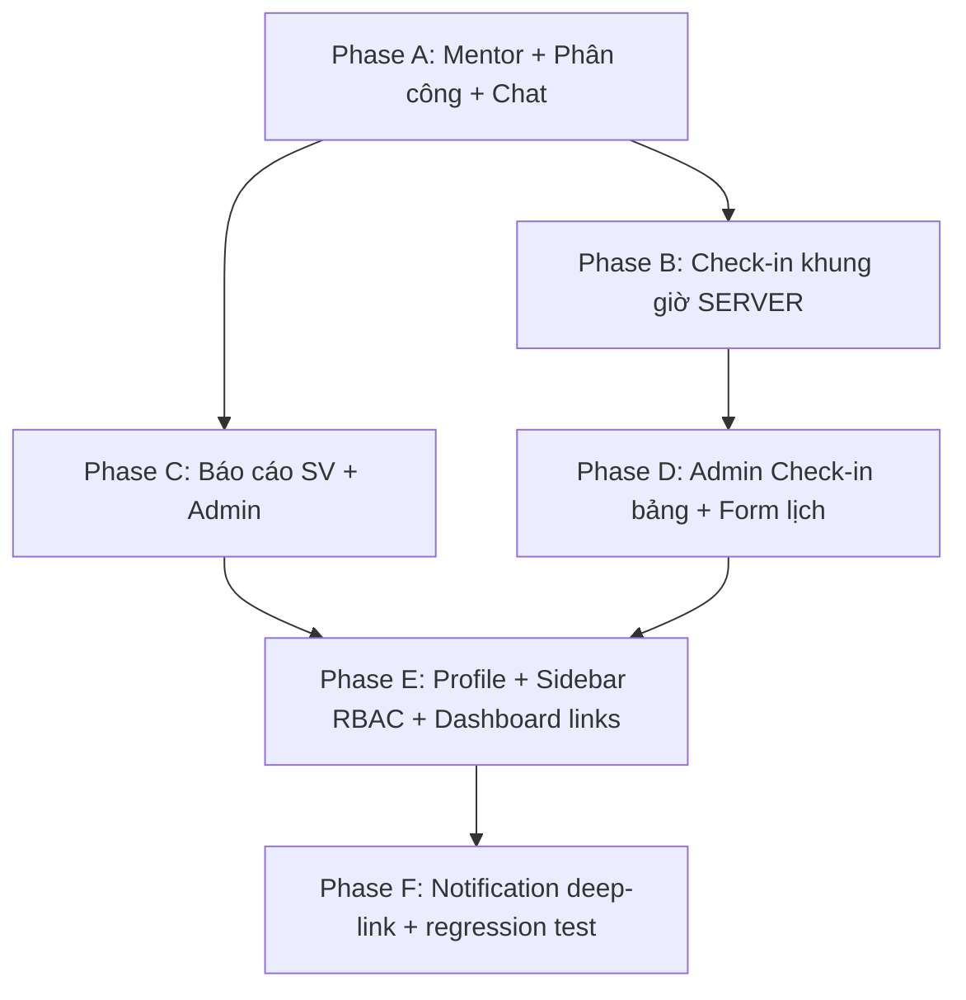

# Kế hoạch sửa lỗi & hoàn thiện theo Role

> Ngày: **18/07/2026**  
> Phạm vi: STUDENT (USER) · ENTERPRISE · ADMIN · Chat/Mentor  
> Nguồn: mô tả bug/feature của user + audit codebase hiện tại

> **Cập nhật triển khai:** P0 (Phase A–C) và P1 (Phase D–F) đã được implement ở mức code ngày 19/07/2026. Cần chạy migration và test tích hợp với MySQL.

## Trạng thái thực hiện (xem nhanh)

### P0 — Đã hoàn thành ở mức code

- [x] CRUD nhiều mentor cho một tài khoản doanh nghiệp
- [x] Tạo tài khoản ENTERPRISE riêng cho từng mentor
- [x] Admin/DN phân công sinh viên cho mentor
- [x] Đồng bộ `students.mentorId` và `internships.mentorId`
- [x] Đổi mentor archive hội thoại cũ; mentor mới có hội thoại mới
- [x] Loại bỏ việc tự tạo mentor placeholder trong Check-in, Report và Task
- [x] Check-in 08:30–09:00, đi muộn 09:01–09:30
- [x] Checkout 16:30–17:00; quá giờ chuyển `ABSENT`
- [x] Server tự quyết định ngày/giờ/trạng thái, chỉ STUDENT được điểm danh
- [x] Filter báo cáo; sửa URL mở/tải file
- [x] Tuần đã nộp/chờ duyệt bị mờ; tuần bị từ chối được nộp lại
- [x] Admin tạo/sửa/xóa template tuần; đính kèm file; hạn nộp hợp lệ
- [x] Admin duyệt theo tuần và không được xóa bài nộp của sinh viên
- [x] Tạo tuần gửi thông báo cho sinh viên thuộc đợt

### P1 — Đã hoàn thành ở mức code

- [x] Admin không thấy khối check-in cá nhân
- [x] Bảng tổng hợp điểm danh theo sinh viên
- [x] Click số buổi mở modal chi tiết ngày, giờ check-in/out
- [x] Form lịch/họp dùng date/time picker và validate cả frontend/backend
- [x] Bổ sung giờ kết thúc cho cuộc họp
- [x] Mã SV sinh cố định từ `userId`, không random timestamp
- [x] SĐT chỉ nhận 8–15 chữ số ở frontend/backend
- [x] Liên hệ khẩn cấp có thể lưu, hiển thị và xóa giá trị
- [x] Profile update giữ nguyên dữ liệu trạng thái báo cáo
- [x] Khóa mã SV, không cho sinh viên sửa
- [x] Disable rõ các nút recovery email/2FA chưa có backend
- [x] Ẩn Profile / Thông tin thực tập / Goals với ADMIN
- [x] Thêm route-level RBAC, không chỉ ẩn Sidebar
- [x] ADMIN Home không còn nút Check-in / Nộp báo cáo
- [x] Dashboard cards điều hướng đến trang tương ứng
- [x] Click thông báo đánh dấu đã đọc và mở đúng Chat/Report/Check-in/Task

### Còn lại / cần kiểm thử

- [ ] Chạy migrations mới trên MySQL/RDS
- [ ] Test E2E Chat bằng 3 tài khoản: chủ DN → mentor → sinh viên
- [ ] Test đúng khung giờ thực hoặc bằng clock mock
- [ ] Test upload/mở file báo cáo với bucket S3 thật
- [ ] Tạo cron/job tự đánh vắng độc lập; hiện tại trạng thái vắng được chốt khi SV tải dữ liệu
- [ ] Recovery email và 2FA thực sự (hiện được disable đúng trạng thái “chưa hỗ trợ”)
- [ ] Kiểm thử responsive bảng điểm danh và modal trên mobile
- [ ] Regression test toàn bộ hệ thống sau migration

---

## 0. Nguyên tắc chung

| # | Nguyên tắc |
|---|------------|
| 1 | **Validate phía server** cho check-in/checkout, ngày giờ lịch, báo cáo — không chỉ UI |
| 2 | **RBAC rõ**: Sidebar + `ProtectedRoute` theo role (không chỉ ẩn menu) |
| 3 | **Mentor = người chat với SV**; ENTERPRISE quản lý mentor / phân công |
| 4 | Làm theo **phase** để tránh đụng quá nhiều file cùng lúc; test từng phase |

---

## 1. Mô hình Role & Mentor (nền tảng cho Chat)

### Hiện trạng (blocking chat)

- Chat lấy hội thoại từ `internships.mentorId` → `mentors.userId` (role `ENTERPRISE`).
- Admin chỉ nhập **tên mentor** (text), không gán `mentorId` thật.
- Auto check-in tạo mentor giả `"Chưa phân công"` với `userId = student.userId` → chat **cố ý từ chối**.
- ENTERPRISE đăng ký **không** tự tạo bản ghi `mentors`.

### Mục tiêu nghiệp vụ (theo mô tả)

```
ENTERPRISE (Doanh nghiệp)
    └── quản lý danh sách Mentor
            └── được phân công Sinh viên (qua Internship)
                    └── Chat 1–1: SV ↔ Mentor đó
```

### Đề xuất mô hình (Phase A — bắt buộc trước khi chat chạy)

| Thành phần | Cách làm |
|------------|----------|
| Role user | Giữ `ENTERPRISE` = tài khoản doanh nghiệp **hoặc** mentor login; khuyến nghị ngắn hạn: **Mentor cũng dùng role `ENTERPRISE`**, phân biệt bằng bản ghi `mentors` |
| Bảng `mentors` | Bắt buộc có `userId` (user đăng nhập chat), `companyName`, `fullName` |
| Khi ENTERPRISE đăng ký | Tự tạo `mentors` gắn `userId` (1 DN = 1 mentor chính) **hoặc** màn hình DN tạo thêm mentor |
| Phân công | Admin/ENTERPRISE chọn mentor từ dropdown → cập nhật **cả** `students.mentorId` **và** `internships.mentorId` |
| Chat | Chỉ tạo conversation khi mentor thật (không placeholder, `userId ≠ student.userId`) |

### Việc cụ thể Phase A

1. API CRUD mentors (`GET/POST/PUT /api/mentors`) — ADMIN + ENTERPRISE (chỉ mentor thuộc công ty mình nếu có `companyId`/`companyName`).
2. UI Admin: **Quản lý mentor** + dropdown phân công trên `StudentManagementPage` / màn phân công.
3. `assign-mentor` cập nhật transaction: student + internship active.
4. Bỏ / không dùng mentor giả trong `checkIn` / `report` / `task` auto-ensure.
5. Khi đổi mentor: archive conversation cũ, list lại conversation mới.
6. Smoke test: SV + Mentor login → `/chat` thấy hội thoại → gửi tin realtime.

**Ước lượng:** 1.5–2 ngày

---

## 2. Role STUDENT (USER)

### 2.1 Check-in & Lịch họp — khung giờ cố định

| Khoảng thời gian | Hành vi |
|------------------|---------|
| **08:30 – 09:00** | Check-in **Đúng giờ** (`ON_TIME`) |
| **09:01 – 09:30** | Check-in **Đi muộn** (`LATE`) |
| **Sau 09:30** | Không cho check-in; status ngày = **Vắng** (`ABSENT`) |
| **Trước 16:30** | Nút Checkout **disabled** (mờ) |
| **16:30 – 17:00** | Checkout được; lịch hiện **Complete** (không chỉ “đã check-in”) |
| **Sau 17:00** | Nếu chưa checkout (kể cả đã check-in) → ngày = **Vắng** / incomplete theo rule chốt |

**Lưu ý:** Giờ cấu hình nên để env/constant (vd `CHECKIN_START=08:30`) để dễ chỉnh sau.

**File đụng:**

- `backend/src/services/checkIn.js` — enforce theo giờ server
- `backend/src/controllers/checkIn.js`, `routes/checkIn.js`
- `frontend/src/pages/CheckInPage.jsx` — UI disable + nhãn Complete / Vắng
- Job/cron nhẹ (optional Phase sau): auto mark `ABSENT` cuối ngày

**Ước lượng:** 1 ngày

---

### 2.2 Hồ sơ cá nhân

| # | Việc |
|---|------|
| 1 | Field số (SĐT, liên hệ gấp…): input `type`/`pattern` + validate backend chỉ số |
| 2 | **Mã SV**: sinh cố định sau đăng ký `SV` + `userId` pad (vd `SV00042`) — **không** random timestamp; khóa không cho SV sửa |
| 3 | Emergency contact: fix clear/save + luôn trả về trong `getMyProfile` / sau update |
| 4 | **Trạng thái báo cáo**: bind đúng data từ API (không reset sau update profile) |
| 5 | **Cài đặt tài khoản**: đổi MK hoạt động; bỏ/disable nút 2FA & quên MK giả nếu chưa có BE |

**File:** `ProfilePage.jsx`, `student.js` (service), `studentService.js` (`persistProfile`)

**Ước lượng:** 0.5–1 ngày

---

### 2.3 Báo cáo (SV)

| # | Việc |
|---|------|
| 1 | Filter trạng thái áp dụng **cả** weekly + standalone (`APPROVED` / `SUBMITTED` / `REJECTED`) |
| 2 | Fix URL file: không prepend `localhost` lên URL S3 tuyệt đối; nút **Mở** / **Tải PDF** dùng URL đúng |
| 3 | Dropdown “Tuần”: chỉ tuần admin đã tạo mà SV **chưa nộp** = selectable; tuần đã nộp = **disabled/mờ** |

**File:** `ReportPage.jsx`, `ReportModal.jsx`, `reportService.js`, (nếu cần) controller report

**Ước lượng:** 0.5–1 ngày

---

## 3. Role ENTERPRISE

| # | Việc | Phụ thuộc |
|---|------|-----------|
| 1 | Dashboard/list mentor thuộc DN | Phase A |
| 2 | Phân công SV cho mentor (hoặc xem SV được giao) | Phase A |
| 3 | Chat chỉ với SV được phân công | Phase A + chat hiện có |
| 4 | (Tuỳ chọn) Xem báo cáo / duyệt nếu DN được cấp quyền — **ngoài scope mô tả lần này** | — |

Sidebar ENTERPRISE: hiện Chat, Check-in/Lịch (nếu cần), Báo cáo (read), Hồ sơ; ẩn module Admin.

**Ước lượng:** gộp trong Phase A (+ 0.5 ngày UI DN)

---

## 4. Role ADMIN

### 4.1 Sidebar / Tổng quan

| Mục | Hành vi |
|-----|---------|
| Tổng quan (Home) | **Ẩn** CTA check-in / nộp báo cáo kiểu SV |
| Hồ sơ cá nhân | **Ẩn** |
| Thông tin thực tập | **Ẩn** |
| Mục tiêu thực tập | **Ẩn** |
| Check-in & Lịch | **Giữ** (dùng cho lịch + bảng điểm danh SV) |
| Báo cáo | **Giữ** (tạo tuần + duyệt) |
| Dashboard, SV, Majors, Periods | Giữ |

**File:** `Sidebar.jsx`, `HomePage.jsx`, `ProtectedRoute` / role gate routes

---

### 4.2 Dashboard — card clickable

| Card | Điều hướng |
|------|------------|
| Sinh viên | `/students` |
| Báo cáo chờ duyệt | `/reports?status=SUBMITTED` (hoặc filter pending) |
| Check-in | `/checkin` |
| (Khác nếu có) | Kỳ thực tập → `/periods` |

**File:** `DashboardPage.jsx`

---

### 4.3 Check-in & Lịch (Admin UX)

1. **Không** hiện block check-in của chính Admin.
2. Giữ **lịch ngày/tháng**.
3. Thêm **bảng điểm danh SV** (hàng = SV):

   | Mã | Họ tên | Lớp | … | Đúng giờ | Đi trễ | Vắng | Tổng buổi |

4. Click số (vd Đúng giờ = 3) → **modal** danh sách 3 buổi: check-in/out `HH:mm:ss`, ngày; nút **X** đóng.
5. Form tạo lịch / họp:
   - Ngày ≥ hôm nay (disabled past trên date picker)
   - Giờ bắt đầu &lt; giờ kết thúc
   - Không nhập chữ vào ô giờ; thêm **time picker icon**

**API mới gợi ý:** `GET /api/checkins/admin/summary?periodId=` + `GET /api/checkins/admin/detail?studentId=&status=`

**Ước lượng:** 1.5–2 ngày

---

### 4.4 Báo cáo (Admin)

#### Tạo tuần báo cáo

Fields: **Đợt thực tập**, **Tuần số**, **Tiêu đề**, **Mô tả**, **đính kèm (optional)**, **Hạn nộp** (≥ hôm nay, làm mờ ngày quá khứ).  
Sau tạo: toast thành công → **đóng tab/form** tạo.  
Notify **mọi SV thuộc đợt**.

#### Quản lý template vừa tạo

- Nút **Sửa / Xóa** ngay dưới badge ACTIVE (chỉ weekly template admin tạo, không xóa bài nộp của SV).

#### Duyệt báo cáo tuần

- Đổi “Chọn sinh viên” → **“Chọn tuần”** (dropdown các tuần admin đã tạo).
- Xem được file SV đã nộp (cùng fix URL).
- Chấm / yêu cầu sửa / duyệt–từ chối: **OK**.
- **Không** cho xóa báo cáo đã nộp của SV.

**File:** `ReportPage.jsx`, `ReportModal.jsx`, `ReviewReportModal.jsx`, `report` service/controller, `notification` khi tạo weekly

**Ước lượng:** 1–1.5 ngày

---

### 4.5 Thông báo

- Click thông báo → điều hướng đúng deep-link (`data.conversationId` → `/chat`, report → `/reports`, …).

**File:** `NotificationsPage.jsx`, payload `data` khi create notification

**Ước lượng:** 0.5 ngày

---

## 5. Thứ tự triển khai đề xuất (Sprint)



| Phase | Nội dung | Ưu tiên | Trạng thái |
|-------|----------|---------|------------|
| **A** | Mentor thật, phân công, sửa chat | P0 | ✅ Code xong · ⏳ E2E |
| **B** | Check-in/out window + Complete/Vắng | P0 | ✅ Code xong · ⏳ test clock |
| **C** | Báo cáo filter, file URL, tuần mờ, admin tạo/duyệt theo tuần | P0 | ✅ Code xong · ⏳ test S3 |
| **D** | Admin bảng điểm danh + modal + validate form lịch | P1 | ✅ Code xong |
| **E** | Profile constraints, ẩn menu Admin, dashboard click | P1 | ✅ Code xong |
| **F** | Deep-link thông báo + test E2E thủ công | P1 | ✅ Deep-link · ⏳ E2E |

**Tổng ước lượng:** ~7–9 ngày làm việc (1 người)

---

## 6. Acceptance Criteria ngắn (smoke)

### Chat / Mentor
- [x] Tạo mentor gắn user ENTERPRISE  
- [x] Phân công SV → internship.mentorId đúng  
- [ ] SV và Mentor mở `/chat` thấy nhau, gửi tin được  
- [x] Mentor chưa phân công → không có conversation  

### Check-in SV
- [x] Ngoài 08:30–09:30 không check-in được (server reject)  
- [x] 09:01–09:30 = LATE  
- [x] Checkout trước 16:30 disabled; 16:30–17:00 = Complete  

### Báo cáo
- [x] Filter trạng thái đúng  
- [x] Mở/tải file đúng URL  
- [x] Tuần đã nộp bị mờ  
- [x] Admin tạo tuần → SV cùng đợt nhận notify  
- [x] Duyệt theo tuần; không xóa bài SV  

### Admin UI
- [x] Ẩn Profile / Internship-info / Goals  
- [x] Dashboard card điều hướng đúng  
- [x] Bảng điểm danh + modal chi tiết buổi  

### Profile SV
- [x] Mã SV cố định, không random  
- [x] Field số chỉ nhận số  
- [x] Liên hệ gấp lưu & hiện lại  

---

## 7. Rủi ro & quyết định cần chốt

| # | Câu hỏi | Đề xuất mặc định nếu không trả lời |
|---|---------|-------------------------------------|
| 1 | ENTERPRISE = 1 công ty nhiều mentor, hay 1 account = 1 mentor? | **Đã chốt:** một tài khoản doanh nghiệp quản lý nhiều mentor; mỗi mentor có tài khoản ENTERPRISE riêng để đăng nhập/chat |
| 2 | Sau 17:00 đã check-in chưa checkout → Vắng cả ngày hay “Thiếu checkout”? | **Vắng** (theo mô tả user) |
| 3 | Timezone? | **Asia/Ho_Chi_Minh** (server) |
| 4 | Admin còn nộp/duyệt báo cáo giúp SV không? | Không tạo hộ; chỉ tạo tuần + duyệt |

---

## 8. File chính sẽ sửa (checklist kỹ thuật)

**Backend:** `checkIn.js`, `report.js`, `student.js`, `chat.js`, `server.js`, routes tương ứng, model `mentor` / migration nếu thêm field, notification payloads  

**Frontend:** `CheckInPage.jsx`, `ReportPage.jsx`, `ReportModal.jsx`, `ReviewReportModal.jsx`, `ProfilePage.jsx`, `Sidebar.jsx`, `DashboardPage.jsx`, `HomePage.jsx`, `StudentManagementPage.jsx`, `NotificationsPage.jsx`, `ChatPage.jsx` (chỉ nếu cần), trang Mentor mới (nếu có)

---

## 9. Bước tiếp theo

Sau khi bạn **OK plan** (hoặc chỉnh mục 7), triển khai theo thứ tự **A → B → C → D → E → F**, bắt đầu Phase A để chat chạy được trước.
